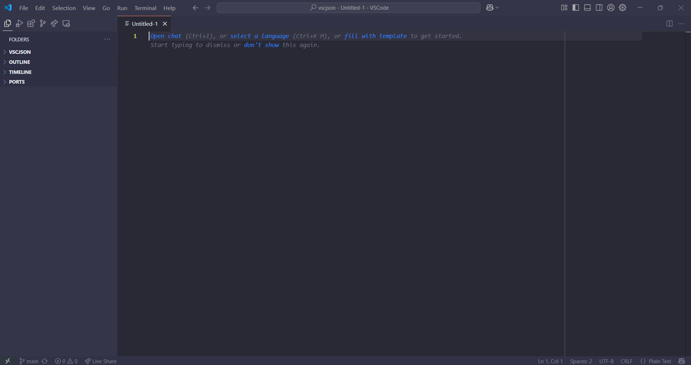

# GitHub Dark Custom Dev Setup

  </img>

 

<i>The settings.json consists of GitHub Dark Theme, to install it <a href="https://marketplace.visualstudio.com/items?itemName=GitHub.github-vscode-theme">click here</a></i>

